  

   

  

   

  

    
    
    
    
  

---

  <table>
    <tr>
      <td align="center" width="150"><a href="https://visernic.com/about">🏢 About Us</a></td>
      <td align="center" width="150"><a href="https://visernic.com/services">🛠 Services</a></td>
      <td align="center" width="150"><a href="https://visernic.com/">📂 Portfolio</a></td>
      <td align="center" width="150"><a href="https://visernic.com/careers">🚀 Careers</a></td>
      <td align="center" width="150"><a href="https://blog.visernic.com/">📰 Blog</a></td>
    </tr>
  </table>

 

### 🚀 About Visernic

**Visernic Limited** is a global leader in software engineering and digital transformation. Founded by **MD Mostafa Niloy**, we operate from the **United Kingdom** and **Bangladesh**, serving clients ranging from ambitious startups to Fortune 500 enterprises.

We don't just write code; we engineer **Digital Ecosystems**. Our team combines technical expertise with creative brilliance to deliver products that dominate the market.

> **Our Mission:** *"To bridge the gap between complex technology and user-friendly experiences, empowering businesses to scale without limits."*

---

### 🚀 Who We Are

**Visernic Limited** is a futuristic Information Technology agency bridging the gap between complex engineering and elegant design. Headquartered in the **United Kingdom 🇬🇧** with global operations in **Bangladesh 🇧🇩**, we serve as a technical partner for startups and Fortune 500 companies alike.

> *"We don't just write code; we architect sustainable digital futures."*

<table align="center" width="100%" style="border: none;">
  <tr>
    <td width="50%" valign="top">
      <h3>🏛 Company Overview</h3>
      <ul>
        <li><strong>Founder & CEO:</strong> MD Mostafa Niloy</li>
        <li><strong>Established:</strong> December 1, 2024</li>
        <li><strong>Headquarters:</strong> Southampton, UK</li>
        <li><strong>Industry:</strong> Software, IT Services, AI & Cloud</li>
        <li><strong>Focus:</strong> Enterprise Scalability & User Experience</li>
      </ul>
    </td>
    <td width="50%" valign="top">
      <h3>⚡ Our Methodology</h3>
      <ul>
        <li>✅ <strong>Agile Development:</strong> Iterative & flexible.</li>
        <li>🔒 <strong>Security First:</strong> OWASP standard compliance.</li>
        <li>☁️ <strong>Cloud Native:</strong> Serverless & Microservices architecture.</li>
        <li>📈 <strong>Data Driven:</strong> Analytics-backed decision making.</li>
      </ul>
    </td>
  </tr>
</table>

---

<h2 align="center">💻 Our Tech Arsenal</h2>

We use the most modern and reliable tools in the industry.

  
  
    
  
  
    
  
  
    
  
  
    
  
  

---

<h2>💼 Our Premium Services</h2>

 

<table width="100%">
  <tr>
    <td width="50%" align="center">
      <h3>🌐 Web Development</h3>
      
Custom Website, PWA, SaaS Platforms, eCommerce Solutions.

    </td>
    <td width="50%" align="center">
      <h3>📱 Mobile App Development</h3>
      
Native iOS & Android, Cross-platform (Flutter/React Native).

    </td>
  </tr>
  <tr>
    <td width="50%" align="center">
      <h3>🎨 UI/UX & Branding</h3>
      
User Research, Wireframing, Prototyping, Logo & Brand Identity.

    </td>
    <td width="50%" align="center">
      <h3>📈 Digital Marketing & SEO</h3>
      
Technical SEO, Google Ranking, Content Marketing, Ads Management.

    </td>
  </tr>
  <tr>
    <td width="50%" align="center">
      <h3>☁️ Cloud & DevOps</h3>
      
Server Management, CI/CD Pipelines, Cloud Security, API Development.

    </td>
    <td width="50%" align="center">
      <h3>🤖 AI & Data Engineering</h3>
      
Data Scraping, Automation Scripts, AI Integration, Business Intelligence.

    </td>
  </tr>
</table>

---

<h2 align="center">🔄 Our Development Workflow</h2>

  <code>💡 Idea</code> ➔
  <code>📝 Planning</code> ➔
  <code>🎨 Design</code> ➔
  <code>💻 Coding</code> ➔
  <code>🧪 Testing</code> ➔
  <code>🚀 Deployment</code> ➔
  <code>🛡️ Maintenance</code>

---

### 💼 Our Premium Services

We provide end-to-end solutions. Here is what we bring to the table:

| **Category** | **Services Offered** |
| :--- | :--- |
| **🌐 Web Engineering** | Enterprise Web Apps • SaaS Platforms • PWA • CMS Development (WordPress/Shopify) |
| **📱 Mobile Solutions** | Native iOS & Android • Cross-Platform (Flutter/React Native) • App Store Optimization |
| **🎨 Creative Design** | Product Design (UI/UX) • Branding & Identity • Prototyping • Motion Graphics |
| **📈 Digital Growth** | Technical SEO • Social Media Marketing • Pay-Per-Click (PPC) • Content Strategy |
| **🛡️ Quality Assurance** | Manual & Automation Testing • Security Audits • Performance Optimization |

---

<h2>🔄 Our Development Workflow</h2>

We follow a strict **Agile** methodology to ensure every line of code meets industry standards.

```mermaid
%%{init: {'theme': 'dark', 'themeVariables': { 'primaryColor': '#3b82f6', 'edgeLabelBackground':'#0d1117', 'tertiaryColor': '#238636'}}}%%
graph LR
    A[🔍 Discovery] --> B(🎨 UI/UX Design)
    B --> C{💻 Engineering}
    C --> D[✅ QA Testing]
    D --> E(🚀 Deployment)
    E --> F[📈 Scale & Support]
    style A fill:#238636,stroke:#fff,stroke-width:2px,color:#fff
    style C fill:#8b5cf6,stroke:#fff,stroke-width:2px,color:#fff
    style F fill:#da3633,stroke:#fff,stroke-width:2px,color:#fff
```

---

## 👨‍💼 Leadership

<table align="center">
  <tr>
    <td align="center">
      
       
      <b>MD Mostafa Niloy</b>
    </td>
  </tr>
  <tr>
    <td align="center">Founder & CEO</td>
  </tr>
</table>

---

## ❓ Frequently Asked Questions (FAQ)

<strong>Do you work with international clients?</strong>

Yes! While we are based in the UK and Bangladesh, 80% of our client base is international. We work across all time zones.

<strong>What is your pricing model?</strong>

We offer both fixed-price project-based models and dedicated team hiring (hourly/monthly) depending on the complexity of your requirements.

<strong>Do you provide post-launch support?</strong>

Absolutely. All our development packages come with a standard 3-month free support period, with options for extended maintenance contracts.

---

  <h2>🤝 Let's Build Something Extraordinary</h2>
  
Ready to start your project? Contact our team today.

| **Office Location** | **Contact Channels** |
| :--- | :--- |
| **Visernic Limited** 54 St Mary's Rd Southampton, United Kingdom Bangladesh Office: Naogaon | 📧 **Email:** [support@visernic.com](mailto:support@visernic.com) 🌠**Web:** [visernic.com](https://visernic.com) 📠**Phone:** +44 7577 062211 |

---

  <h2>🤝 Let's Build Something Extraordinary</h2>
  
Ready to start your project? Contact our team today.

  

    <strong>📠Head Office:</strong> 54 St Mary's Rd, Southampton, UK 
    <strong>📧 Support:</strong> <a href="mailto:support@visernic.com">support@visernic.com</a> 
    <strong>📞 Phone:</strong> +44 7577 062211
  

  

---

  
  
  

  <em>© 2024 Visernic Limited. All rights reserved.</em>

